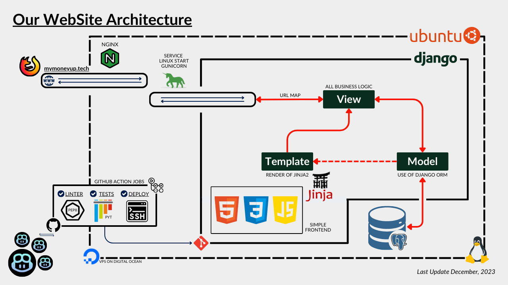

# MyMoneyUP
MyMoneyUP is a django project for track your assets, and send a
email with a report and a newsletter with the progress and performance of 
that assets. Check in [mymoneyup.tech](https://mymoneyup.tech) :|

TODO: Put a GIFT of the website view here!

## Installation
For the correct operation of the project, it is necessary to have installed the following programs:
+ Python 3.10 (or higher)
+ Pip 22 (package installer for Python)
+ Python VENV (virtual environment)
+ PostgreSQL (12 or higher, 16 recommended)

Create a virtual environment
```bash
python3 -m venv env
```

Activate the virtual environment
```bash
source env/bin/activate
```
Or in Others OS :| 
```bash
env\Scripts\Activate.ps1 # Windows PowerShell
env\Scripts\Activate.bat # Windows CMD
. env/bin/activate # Mac & Linux?
```

Install the requirements (don't forget activate the venv!)
```bash
pip install -r requirements-dev.txt
```

Create migrations
```bash
python manage.py makemigrations
```

Create the file .env

+ Now! Stop! We need create a file .env in the root of project, and add the 
same variables of .env.example file, click here for check what mean each 
variable: [File of Variables](#file-of-variables).

#### Create the database in PostgreSQL
```bash
sudo -u postgres psql # Enter to postgresql
-
CREATE DATABASE mymoneyup;
-
\l # List databases (check if the database was created)
\c mymoneyup # Connect to database (check if can connect)
\dt # List tables (check if the database is empty)
\q # Exit of postgresql
```

Run the migrations
```bash
python manage.py migrate
```

Create a superuser
```bash
python manage.py createsuperuser
```

Run the server
```bash
python manage.py runserver
```

---
---
---

## How Contribute?
For contribute in this project, you need to follow the next steps:

1. Fork this repository
2. Clone your forked repository
3. Create a new branch
4. Make your changes
5. Run the tests
6. Pre-Commit your changes
```bash
pre-commit run --all-files
```
7. Push your changes to your forked repository
8. Make a pull request

Clone repository
```bash
git clone THE_URL_OF_YOUR_FORKED_REPOSITORY
```
Update repository
```bash
git pull origin main # or use fetch and merge :|
```
Create a new branch
```bash
git checkout -b name_of_your_new_branch
```
Check the status of your repository
```bash
git status # check the files modified!
git branch # check the branch!
```

Make your changes
+ For your first contribution, you can add your name in the list of collaborators
in the file README.md, and then, make a pull request.

Don't forget to make your tests before and after make your changes
```bash
pytest
```

Add your changes
```bash
git add . # add all files modified
git add name_of_file # add a specific file
```
Commit your changes
```bash
git commit -m "a message of your commit"
```
Push your changes to your forked repository
```bash
git push # fail, because you need to set upstream your branch
git push --set-upstream origin name_of_your_new_branch
```

Make a pull request
+ Go to your forked repository in GitHub, and click in the button "Compare & pull request"
+ Add a title and a description of your pull request
+ Click in the button "Create pull request"

And that's it, you made your first contribution :D
For more changes, you can repeat the steps, don't forget update your repository!

---
---
---

## File of Variables
In this file we have the variables of environment, obviously, this file is
ignored by git, because we don't want to share our secrets with the world.

### The fundamental variables are:
+ SECRET_KEY = 'a random key for Django security'
+ DEBUG = True/False (use True only in development)
+ PATH_CONFIG_YAML = 'path of config.yaml file in the root of project'
+ DOMAIN_DEV = 'domain of development (in local is "127.0.0.1")'

### DataBase Variables:
Remember, first [create the database in PostgreSQL](#create-the-database-in-postgresql), and then, add these variables!
+ DBNAME_DEV = 'name of database'
+ DBUSER_DEV = 'user of database (default is postgres)'
+ DBPASSWORD_DEV = 'password of database'
+ DBHOST_DEV = 'host of database (default is localhost)'
+ DBPORT_DEV = 'port of database (default is '5432')'

### More variables (not fundamental):
+ EMAIL_USER_DEV = 'from (gmail) for send emails'
+ EMAIL_PASSWORD_DEV = 'obtained from gmail for not secure apps!'

---
---
---

## About More of Project
For make a project with a good architecture, we made this diagram, and it's 
a responsibility of all developers, follow and maintain the better practices :|


### For Developers
Tree of the project
```bash
tree -I "env|.git|.pytest_cache|__pycache__" -la
```

To populate the project we offer this scripts:
+ For Linux
```bash
sh .github/fordevs/backups/populate_project.sh 
```
o
```bash
bash .github/fordevs/backups/populate_project.sh 
```

If you want to delete the data in your database you can run this scripts
+ For Linux
```bash
sh .github/fordevs/backups/delete_all_data.sh 
```
o
```bash
bash .github/fordevs/backups/delete_all_data.sh 
```

Don't forget to make your tests before and after make your changes
```bash
pytest
```

## Collaborators
- [Lorenzo](https://github.com/LorenzoFerreyra)
- [Gael](https://github.com/esgaelramos)
- [Jorge](https://github.com/JorgeGarcia-Dev)
- [Camila](https://github.com/CamilaPua)
- [Alejimho (la secuela)](https://github.com/alejimhouwu)
- [Andriw](https://github.com/AndriwRC)

# END!